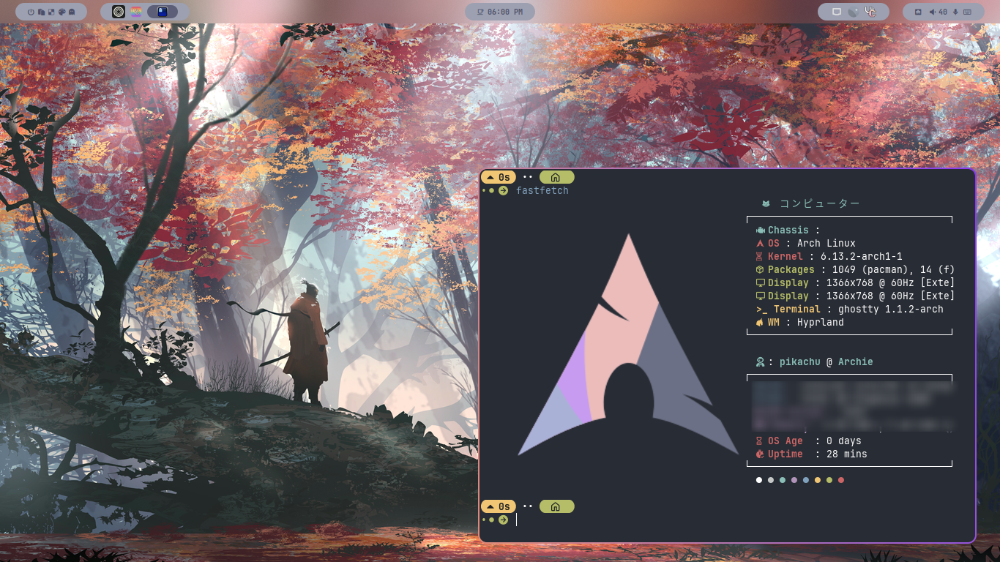
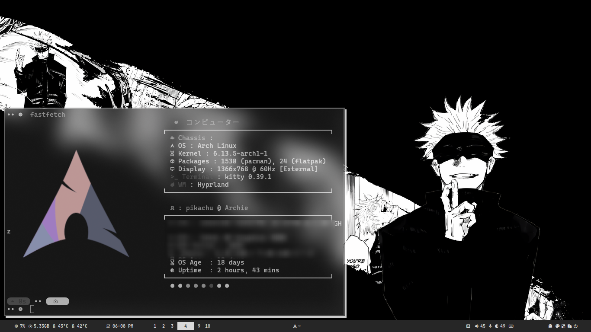
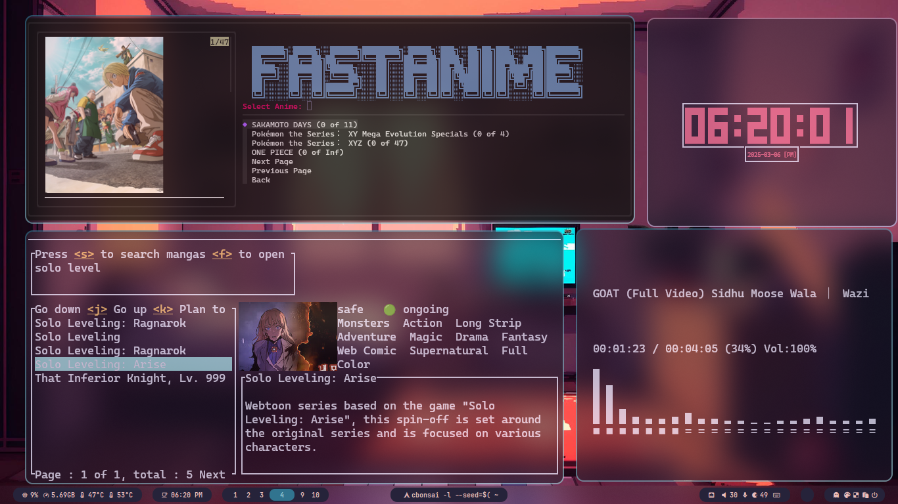
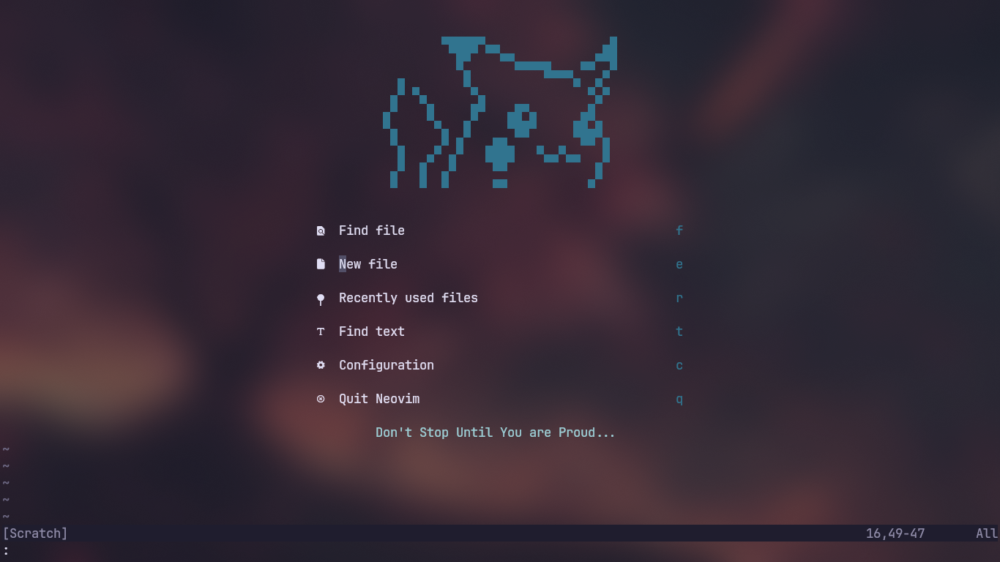
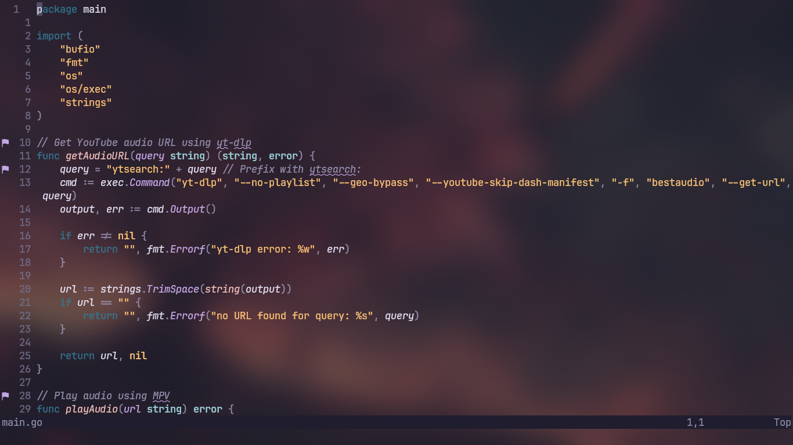

# My Cool dotfiles

 

 

 

**I use These tools in my current Arch linux setup :**

- Neovim 
- Fish shell
- Hyprland ( with hyprdots )
- kew , tuisic , spotify with spicetify ( for listening to music )
- I have cool wallpapers 
  
**My Neovim setup :** 

## You can see which plugins i use in nvim/lua/plugins folder.

