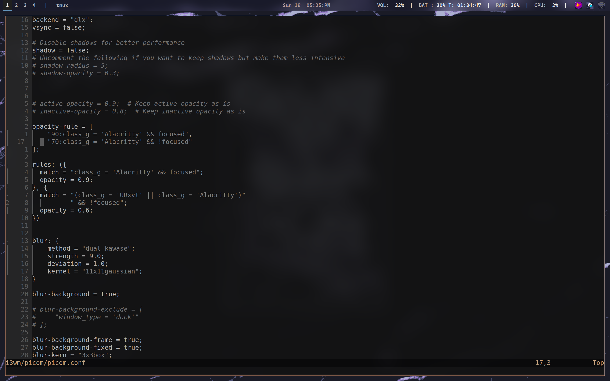

# My Cool dotfiles

## My current i3wm setup

**I use These tools in my current linux setup :**

- Neovim 
- Zsh shell
- i3wm
    - polybar
    - rofi ( i took a rice from internet )
    - dunst
    - i3lock
- kew
- zen browser
- I have cool wallpapers 
  
**My Neovim setup :** 

## You can see which plugins i use in nvim/lua/plugins folder.

